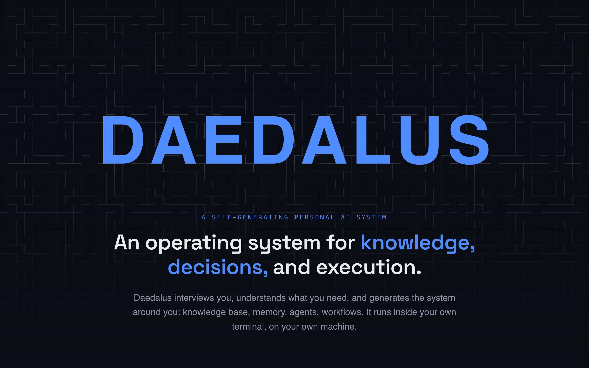
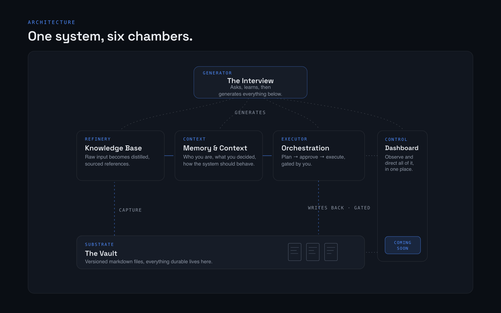
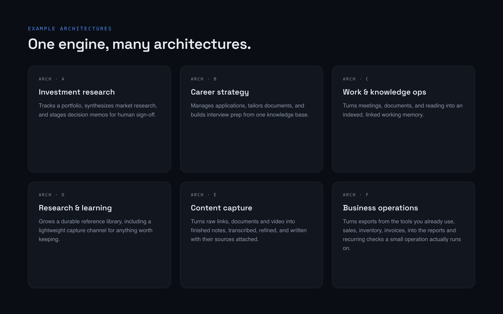

  

# Daedalus Engine

**A personal AI system that builds itself around you.** It interviews you once, then turns an
[Obsidian](https://obsidian.md) vault into a working system: a knowledge base that keeps its
provenance, context that survives between sessions, and agents chosen for what *you* are actually
trying to do.

It runs in your terminal on your own [Claude Code](https://claude.com/claude-code) login. No API
keys, no server, no account, no service of mine in the loop: your vault is a folder of Markdown
files that stays on your disk. The model calls go to Anthropic through your own Claude Code session,
like any other Claude Code work.

> ### 🔒 Closed beta · v1
> This repository is the **public front door**: what Daedalus is, how it works, what it does and
> doesn't do. The engine itself is in a private repository and access is given by request, one
> person at a time.
>
> **[→ Request access](mailto:daedalus.engine.help@gmail.com?subject=Daedalus%20Engine%20beta%20access)** · or read the [full presentation](https://francescogbrogna-svg.github.io/daedalus-engine/).

---

## The idea

Knowledge shouldn't live in a labyrinth. Notes in one app, sources across thirty tabs, decisions
buried in AI chats that forget you the moment they end. The raw material of good thinking gets
scattered, and every day starts with finding it again.

Daedalus is one system that holds what you know, remembers what you decide, and does the part that
matters: it **adapts its own shape to how you work**. It doesn't ship as a fixed product. It begins
with a conversation about what you are working towards, and from the answers it generates the
architecture around you.

## How it works

| Step | What happens |
|---|---|
| **1. The interview** | `/setup` asks what you want to achieve, what your material is, how you work. A few minutes, in plain language. |
| **2. The knowledge base** | `raw/` → `wiki/` → `output/`: sources become worked, cross-linked notes that always point back to where a claim came from. |
| **3. Memory & context** | Who you are, what you decided, how the system should behave: carried across sessions instead of evaporating between them. |
| **4. The agents** | Out of a library of **217**, the interview picks the handful your goal needs and installs them into your vault as plain files you own. |
| **5. Capture** | `/capture <url>` pulls an article, or a video through the captions it publishes, into `raw/` with its source attached, then works it up like anything else. No account, no key. |
| **6. The loop** | `/prime` → `/create-plan` → `/implement` → `/commit`. Plan, approve, execute, version. Nothing consequential happens without your sign-off. |

  

**One system, six chambers.** Every part has one job, and every flow that matters passes through
your hands. The control room is the one chamber that isn't in v1 yet.

  

**One engine, many architectures.** The same system configures very differently for a thesis, a set
of client projects, a research paper, or the operations of a small business. The range is the point.

## Design principles

- **Human approval before any consequential action**: the gate is never automated away.
- **Every change is diffed, versioned, reversible**: it is all Markdown in git.
- **Code where code is enough**, AI reserved for genuine judgment.
- **Your files stay yours**: Markdown in a folder you own, no database, no service, no telemetry.
  (Inference is not local: prompts and file contents go to Anthropic through your own login, as in
  any Claude Code session.)
- **Text, not spreadsheets**: what it keeps and connects is Markdown (notes, documents, sources).
  It can drive other files when you ask, but that is not what it is for.

## What's in v1, and what isn't

**In:** the interview, the knowledge pipeline, layered context, the agent library, capture from a
URL, and the five commands. Everything is driven from the terminal through Claude Code.

**Not yet:** the visual control room and the automated ingestion pipelines. They exist in the system
I use every day; they ship when they are good enough to hand to someone else. v1 is terminal-first
on purpose: fewer moving parts, nothing to install, nothing to break.

## Access

The beta is closed: access is by request, so that I can help when something breaks and hear what
actually needs fixing.

**[Request access →](mailto:daedalus.engine.help@gmail.com?subject=Daedalus%20Engine%20beta%20access)**

## License

MIT. The agent library ships under its own MIT license and attribution (AgentLand Contributors).
